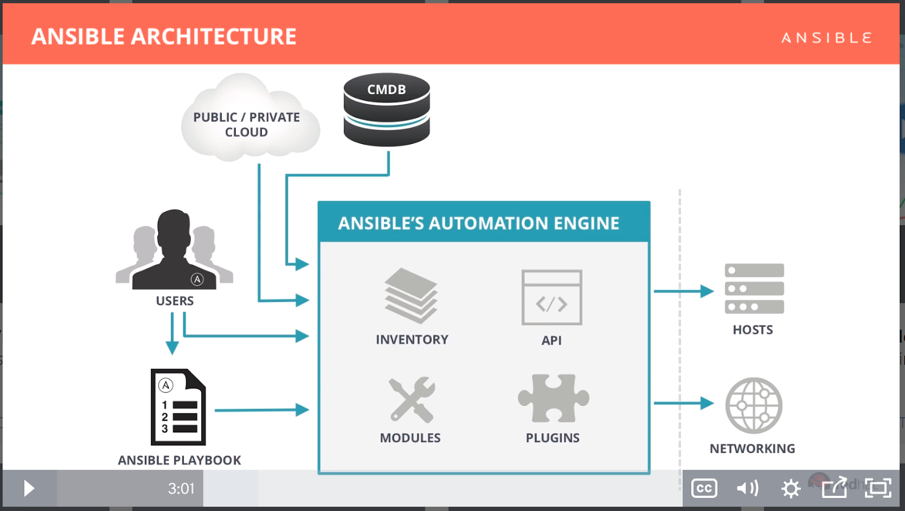
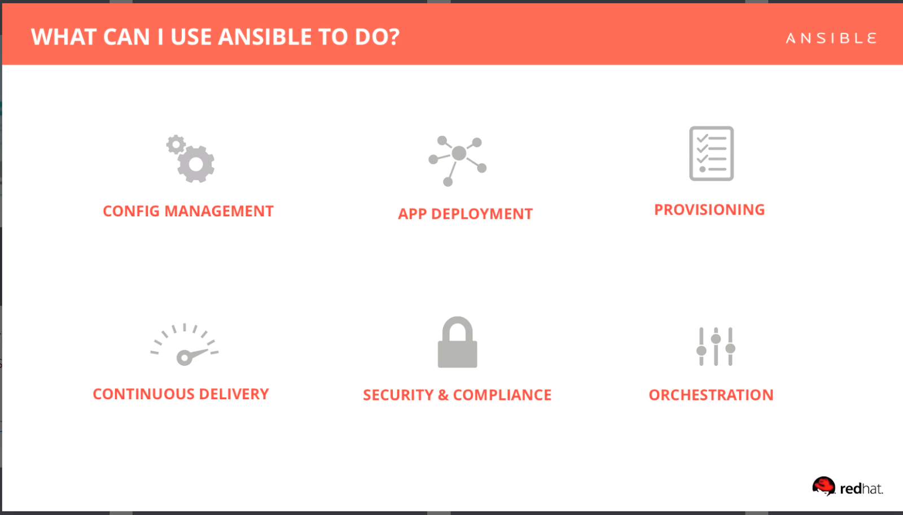
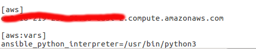
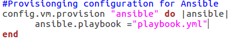

# Getting Started with Ansible
## Intro
I'm using [Ansible for Devops][ab140a78]  to get started with Ansible. This book was recommended by Amaozon "Patrik J. Kerpan" as a good book to learn by doing. He further stated that each of the example provide value on how you use the ansible framework for real world purposes.

In this lab I will get started with Ansible by first orchestrate some AWS EC2 server. Then I will use vagrant to start up a Centos 7 server.
## Overview
### What is Ansible
- Simple automation languange that describe an IT application infrastructure.
- Automation engine that runs Ansible playbooks
- Ansible tower is an enterprise framework for controlling, securing, and managing your Ansible automation with a UI and restful API.

 | 
-------------------------|-------------------------
Ansible Architecture | What can Ansible Do  
## Details
### Getting Started with Ansible

##### Setting Ansible

I am using Ubuntu 16.04. I first started by installing Ansible with this commands.

`sudo  apt-add-repository -y ppa:ansible/ansible`

`sudo apt-get update`

`sudo apt-get install -y ansible `

Now let's use Ansible to connect to an AWS server. I had already created an EC2 instance therefore I will not showcase that process. But In order to get access to my EC2 through SSH I had to go through some loophole.

1. First I had to create a ssh rsa key pair on my local machine `ssh-keygen -t rsa` this created “/.ssh/id_rsa" and "/.ssh/id_rsa.pub"

2. Now login on the aws server through ssh I was able to tun the following commands.`useradd -m <yourname> ` `sudo su <yourname>` `cd ` `mkdir -p ~/.ssh` `touch ~/.ssh/authorized_keys` `chmod -R 700 ~/.ssh` `chmod 600 ~/.ssh/*`
3. The I uploaded my local ~/.ssh/id_rsa.pub to the server and passed it to the new authorized_keys files that I created `cat id_rsa.pub  > ~/.ssh/authorized_keys`
4. Login for Ansible was accepted after that.

Running Ansible command came with some issue because of AWS using python3 command to run python program. We need to tell Ansible to use python3 as the default python. Configuration of the ansible server is saved under /etc/ansible/hosts. This host file keep an inventory of the servers that Ansible can use. In order to use python3 the following needed to be done.


--
Ansible config files

##### Setting vagrant and virtualBox
Visit each software website to downloaded both vagrant and virtualBox.
Vagrant is a tool for building and managing virtual machine environments in a single workflow. When setting up vagrant boxes following need to be done.


>```shell
name@name: vagrant box add geerlingguy/centos7
name@name: vagrant init geerlingguy/centos7
name@name: vagrant up
```
console command to get Centos 7 box and start the server

Vagrant provide some important functionality. These can be found in the [Documentation][1e28e4fe].
Some of the functionality include
- Network interface management: Vagrant offers multiple options for how you are able to connect your guest machines to the network. Forward ports to a VM, share public network connection, or use private networking for inter-VM and host only communication.
- Shared folder management: enable Vagrant to sync a folder on the host machine to the guest machine, allowing you to continue working on your project's files on your host machine, but use the resources in the guest machine to compile or run your project.
- Multi-machine management: Vagrant is able to define and control multiple guest machines per Vagrantfile.These machines are generally able to work together or are somehow associated with each other. Here are some use-cases people are using multi-machine environments for today:
 - Accurately modeling a multi-server production topology, such as separating a web and database server.
 - Modeling a distributed system and how they interact with each other.
 - Testing an interface, such as an API to a service component.
 - Disaster-case testing: machines dying, network partitions, slow networks, inconsistent world views, etc.
 - Provisioning: Vagrant allow you to automatically install software, alter configurations, and more on the machine as part of the vagrant up process.

 I was able to make ansible work on vagrant by configuring the Vagrantfile.

 --

 Vagrantfile configuration

We set up a very basic playbook “playbook.yml” in the same folder as the Vagrantfile. [Playbooks][0abf06a5] are Ansible’s configuration, deployment, and orchestration language. They can describe a policy you want your remote systems to enforce, or a set of steps in a general IT process. One can use [this link][fbb9b680] to get started with YAML. For Ansible, nearly every YAML file starts with a list. Each item in the list is a list of key/value pairs, commonly called a “hash” or a “dictionary”. So, we need to know how to write lists and dictionaries in YAML. Network Time Protocol (NTP) is a networking protocol for clock synchronization between computer systems over packet-switched, variable-latency data

>```yaml
# Marker showing that the rest of the document will be formatted in YAM
---
# This line tells Ansible to which hosts this playbook applies.
# All works here because vagrant is using its own Ansible Inventory file.  
- hosts: all
# Give sudo access to install NTP and modify system configuration
become: yes
# All the defined task will be run on all hosts
tasks:
# Equivalent to running yum install ntp but with the intelligence to check if ntp is installed and if not install it.  
- name: Ensure NTP (for time synchronization) is installed.
  yum: name=ntp state=present
- name: Ensure NTP is running.
  service: name=ntpd state=started enabled=yes 		
...
```
playbook.yml

  [7906e88b]: https://github.com/ansible/ansible-examples "Github Ansible Example"


## Conclusion
In this Lab, I set up my Ansible environment. I was able to use the documentation and book to understand the lab. Refer to references in order to get a in depth details of the information covered in the this lab. Furthermore, I was able to use vagrant to start a centos 7 server. I then used Ansible's playbook to orchestrate that server by running yum install to NTP through ansible yaml file.

## References
1. [YAML getting started ][d3a7d5a6]
2. [Github Ansible Examples][b5e927f0]

---

  [ab140a78]: https://www.amazon.com/Ansible-DevOps-Server-configuration-management/dp/098639341X/ref=sr_1_1?ie=UTF8&qid=1521573918&sr=8-1&keywords=ansible+for+devops "Ansible for DevOps"

  [1e28e4fe]: https://www.vagrantup.com/docs/index.html "Documentation"

  [0abf06a5]: http://docs.ansible.com/ansible/latest/playbooks.html "Playbooks"

  [fbb9b680]: http://docs.ansible.com/ansible/latest/YAMLSyntax.html "yaml link"

  [d3a7d5a6]: http://www.yaml.org/start.ht "YAML getting started"

  [b5e927f0]: https://github.com/ansible/ansible-examples "Github Ansible Examples"
