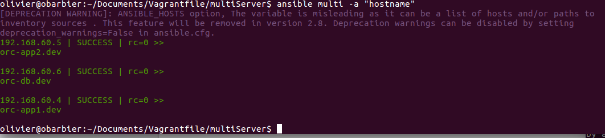

# Ad-Hoc Commands
## Intro
An ad-hoc commands are commands that one might type in to do something really quick, but don’t want to save for later. They are a good place to start to understand the basics of what Ansible can do prior to learning the playbooks language. ad-hoc commands can also be used to do quick things that you might not necessarily want to write a full playbook for.

## Overview
In this lab, I will be using ad-hoc commands to interact with server. I will be orchestrating three different server one Database server and 2 applications servers. This architecture is pictured in the following figure.


--
Sample application Infrastructure

## Details
I first started by configuring the Vagrantfile to tell vagrant to create 3 servers.


--
 Vangrantfile config

 As one can see we are using ip addresses 192.168.60.4, 192.168.60.5, 192.168.60.6 for the private network.
 I then configure Ansible host file to create the inventory for the server we made.

 ```yaml
 #Applications Servers
 [app]
 192.168.60.4
 192.168.60.5

 #database server
 [db]
 192.168.60.6

 #Group 'multi' with all servers
 [multi:children]
 app
 db

 #variable that will be applied to all severs
 [multi:vars]
 ansible_ssh_user=vagrant
 ansible_ssh_private_key_file=~/.vagrant.d/insecure_private_key

 ```

Now let's run ad-hoc commands that allows user to check the resources on the servers.
- `ansible multi -a 'hostname'`: This command return the hostname of the servers. Ansible will run this command this command in parallel against all the servers (order is not maintained by default). “-f 1 ” is added to tell Ansible to use only fork, in sequence calls.
 
 --
 Hostname ad-hoc result

- `ansible multi -a 'df -h'`: This command return the amount of free disk on the servers.

 --
 Freedisk ad-hoc result

- `ansible multi -a 'free -m'`: This command return the free memory on the servers.
  
 --
 Free Memory ad-hoc result

- `ansible multi -a 'date'`: This command retutn the date on each server.

 --
 Date ad-hoc result


Side Note: Tools like Munin, Nagios, Cacti, Hyperic, Pingdom, Server Check.in, etc. can be used to have a good idea of the servers’ past and present resource usage.


## Conclusion

## References

---
